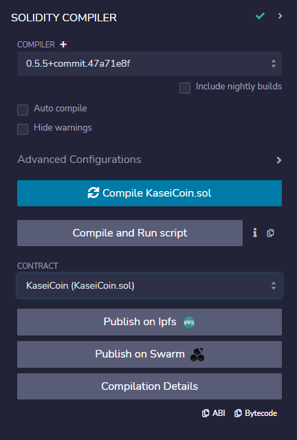
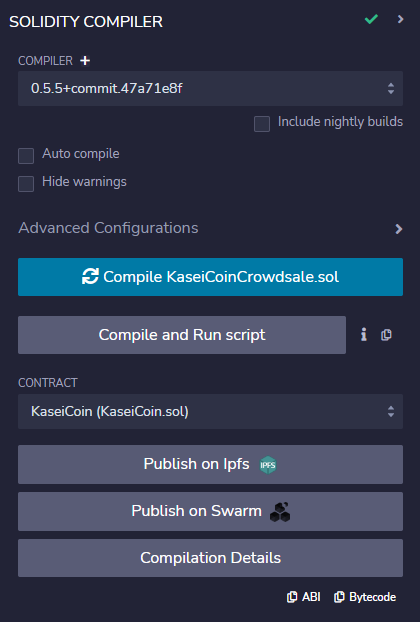

# Unit 21: Martian Token Crowdsale

## Table of content
- [Background](https://github.com/Nithy29/Martian_Token_Crowdsale#background) 
- [Overview of the project](https://github.com/Nithy29/Martian_Token_Crowdsale#overview-of-the-project) 
- [Work Files](https://github.com/Nithy29/Martian_Token_Crowdsale#Work-Files) 
- [Project steps](https://github.com/Nithy29/Martian_Token_Crowdsale#project-steps)
- [Software version control](https://github.com/Nithy29/Martian_Token_Crowdsale#software-version-control)
    - [Work with GitHub](https://github.com/Nithy29/Martian_Token_Crowdsale#work-with-github)
    - [How to install](https://github.com/Nithy29/Martian_Token_Crowdsale#how-to-install)
- [Helps recruiters](https://github.com/Nithy29/Martian_Token_Crowdsale#helps-recruiters)
- [License](https://github.com/Nithy29/Martian_Token_Crowdsale/blob/main/LICENSE)

## Background

After waiting for years and passing several tests, the Martian Aerospace Agency selected me to become part of the first human colony on Mars. As a prominent fintech professional, they chose me to lead a project developing a monetary system for the new Mars colony. I decided to base this new system on blockchain technology and to define a new cryptocurrency named **KaseiCoin**. (Kasei means Mars in Japanese.)

## Overview of the Project

We will be creating a fungible token called KaseiCoin. KaseiCoin will be a fungible token that’s ERC-20 compliant. I’ll launch a crowdsale that will allow people who are moving to Mars to convert their earthling money to KaseiCoin.

## Project Note

    - The starter code files have `pragma solidity ^0.5.0' as per project instructions. But one io the OpenZeppelin is at 0.5.5. 
      The file is https://github.com/OpenZeppelin/openzeppelin-contracts/blob/release-v2.5.0/contracts/utils/Address.sol. The contracts are compuiled at 0.5.5
    - Ganache is used as local block chain testing network
    - MetaMask is used as the local wallet connected to Ganache

## Works Files

[KaseiCoin.sol](./Starter_Code/KaseiCoin.sol)
[KaseiCoinCrowdsale.sol](./Starter_Code/KaseiCoinCrowdsale.com)

## Instructions Followed

1. Completing `KaseiCoin` contract in file `KaseiCoin.sol`

2. Completing `KaseiCoinCrowdsale` contract in file `KaseiCoinCrowdsale.sol`

3. Completing `KaseiCoinCrowdsaleDeployer` contract in file `KaseiCoinCrowdsale.sol`
   

4. Compiling and Deploying the Crowdsale contract
    <table>
    <tr>
        <td>Compilation of  'KaseiCoin.sol'</td>
        <td>Compilation of  'KaseiCoinCrowdsale.sol'</td>
        <td>Deployed of  'Crowdsale'</td>
    </tr>
    <tr>
        <td></td>
        <td></td>
        <td>  </td>
    </tr>
    </table>
    

5. Deploying the Crowdsale contract - Video 

https://user-images.githubusercontent.com/98414364/180317507-73599446-0231-4366-b441-496835830083.mp4

6. Testing Functionality 

https://user-images.githubusercontent.com/98414364/180318451-d1f15ef1-fe8e-4c46-9b70-9ccd34895d6a.mp4

7. Review of Test

https://user-images.githubusercontent.com/98414364/180318530-dde1ecc2-b968-48db-a916-273325bb9c98.mp4

8. Importing of Coin 

https://user-images.githubusercontent.com/98414364/180319084-8ed5aaa5-0e64-4585-ad72-8958ac743904.mp4

9. Optional work 
   - Deployment

https://user-images.githubusercontent.com/98414364/180321346-a7980c0c-5821-4eb3-9a01-b7a248e936c7.mp4

       
   - Transacting on Optional Work

https://user-images.githubusercontent.com/98414364/180321876-36dd72dc-8dfe-44ff-8d0b-13b93ee78fdf.mp4

   - Transfer Coin
   
https://user-images.githubusercontent.com/98414364/180322330-89f2b85a-e6e9-4949-a9da-00dbbf9b4c8a.mp4

   
   
    
    
